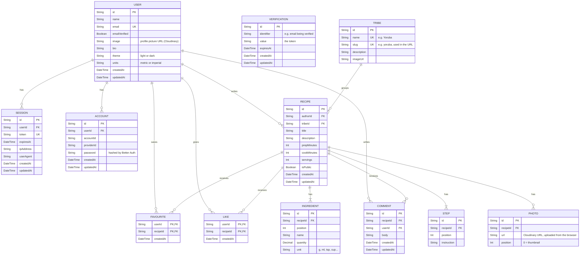

# Naija Kitchen ER diagram

SESSION, ACCOUNT and VERIFICATION are generated by Better Auth (`npx @better-auth/cli generate`). Don't edit them by hand.

```mermaid
erDiagram
    USER {
        String id PK
        String name
        String email UK
        Boolean emailVerified
        String image "profile picture URL (Cloudinary)"
        String bio
        String theme "light or dark"
        String units "metric or imperial"
        DateTime createdAt
        DateTime updatedAt
    }

    SESSION {
        String id PK
        String userId FK
        String token UK
        DateTime expiresAt
        String ipAddress
        String userAgent
        DateTime createdAt
        DateTime updatedAt
    }

    ACCOUNT {
        String id PK
        String userId FK
        String accountId
        String providerId
        String password "hashed by Better Auth"
        DateTime createdAt
        DateTime updatedAt
    }

    VERIFICATION {
        String id PK
        String identifier "e.g. email being verified"
        String value "the token"
        DateTime expiresAt
        DateTime createdAt
        DateTime updatedAt
    }

    TRIBE {
        String id PK
        String name UK "e.g. Yoruba"
        String slug UK "e.g. yoruba, used in the URL"
        String description
        String imageUrl
    }

    RECIPE {
        String id PK
        String authorId FK
        String tribeId FK
        String title
        String description
        Int prepMinutes
        Int cookMinutes
        Int servings
        Boolean isPublic
        DateTime createdAt
        DateTime updatedAt
    }

    PHOTO {
        String id PK
        String recipeId FK
        String url "Cloudinary URL, uploaded from the browser"
        Int position "0 = thumbnail"
    }

    STEP {
        String id PK
        String recipeId FK
        Int position
        String instruction
    }

    INGREDIENT {
        String id PK
        String recipeId FK
        Int position
        String name
        Decimal quantity
        String unit "g, ml, tsp, cup..."
    }

    COMMENT {
        String id PK
        String recipeId FK
        String userId FK
        String body
        DateTime createdAt
        DateTime updatedAt
    }

    LIKE {
        String userId PK, FK
        String recipeId PK, FK
        DateTime createdAt
    }

    FAVOURITE {
        String userId PK, FK
        String recipeId PK, FK
        DateTime createdAt
    }

    USER ||--o{ SESSION : has
    USER ||--o{ ACCOUNT : has
    USER ||--o{ RECIPE : writes
    USER ||--o{ COMMENT : writes
    USER ||--o{ LIKE : gives
    USER ||--o{ FAVOURITE : saves
    TRIBE ||--o{ RECIPE : groups
    RECIPE ||--o{ PHOTO : has
    RECIPE ||--|{ STEP : has
    RECIPE ||--|{ INGREDIENT : has
    RECIPE ||--o{ COMMENT : receives
    RECIPE ||--o{ LIKE : receives
    RECIPE ||--o{ FAVOURITE : receives
```
